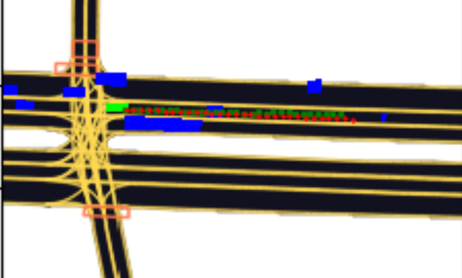
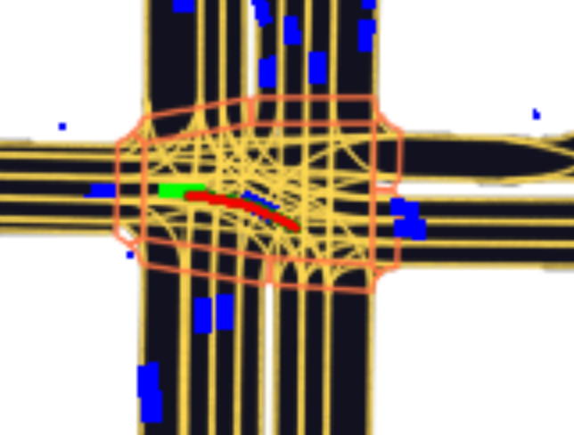
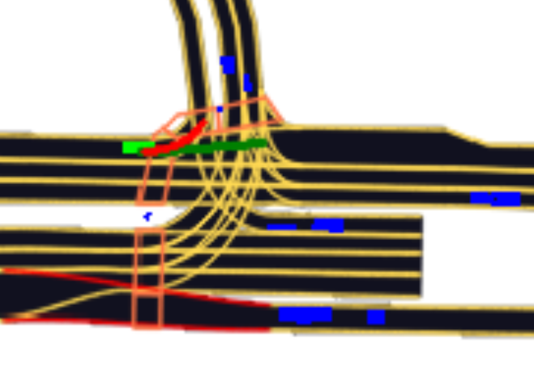
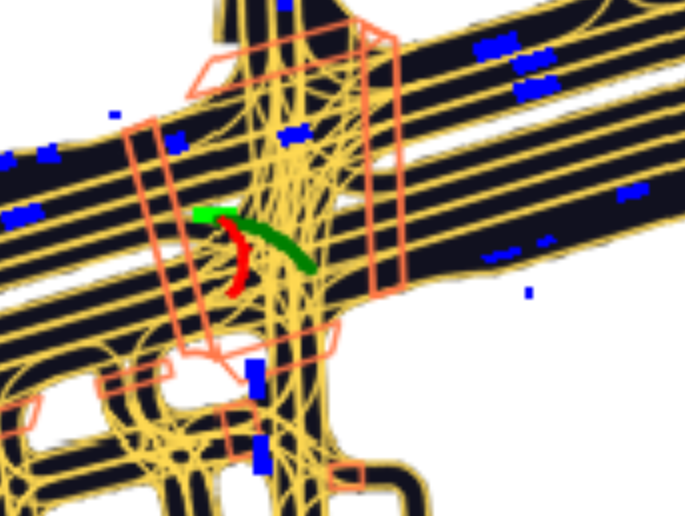
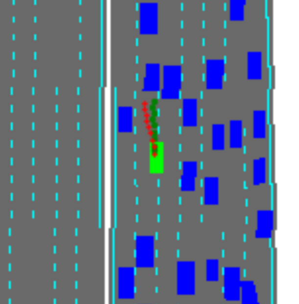

Trajectory prediction REPO for predicting future trajecotories of vehicle given past trajectories.

Framework accepts Dataset in following format:
1. Sample dataset is given under dataset/ngsim2lyft_subset folder
2. CSV_File containing trajectories sequences (PAST as well as FUTURE), stored in train_csvs folder under dataset
3. MAP and MASK frame images are stored in train_images folder under dataset
4. Models and plots are saved in outputs folder under dataset

For conversion of Dataset to Framework format:
1. NGSIM -> use ngsim2lyft.py
2. LYFT -> lyft_prediction_dataset1.py

USE config.py to set the path of Dataset folder and Hyperparameters.

USE train.py for training -> python train.py

Use test_predictions.py for testing. -> python test.py

Initial Results using LYFT dataset: (11 (history + current) frames - 30 future predictions)

Initial Results using NGSIM dataset: (10 (history + current) frames - 19 future predictions)

